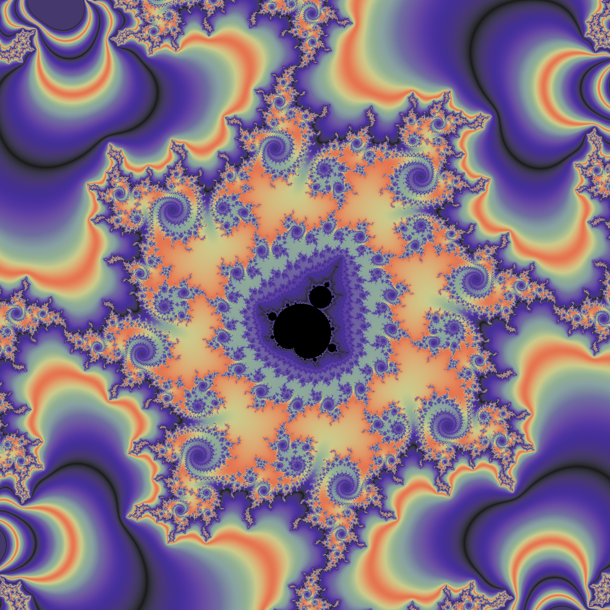

# CUDA Fractal Generator

## Prerequisites

* Visual Studio 2022
* CUDA Toolkit 11.5

## Building Dependencies

1. `git submodule update --init --recursive`
2. Open Developer PowerShell
3. cd third_party/
5. ./build.ps1

## Building

1. Open fractal.sln
2. Build "Release" for "x64"

## Basic Usage

To run interactively:

    .\bin\x64\Release\fractal.exe -interactive

Interactive controls:

* Left Click / Page Down = Zoom In
* Right Click / Page Up = Zoom Out
* Middle Click = Centre
* Ctrl + <Click> = Zoom Faster
* Shift + Left Click = Save Image

To render one image with specific coordinates:

    .\bin\x64\Release\fractal.exe -re 0.16008284883560522 -im 0.5725060571509984 -scale 0.00000244

To render using a YAML configuration:

    .\bin\x64\Release\fractal.exe config\examples\5.yaml

You can specify multiple YAML configurations:

    .\bin\x64\Release\fractal.exe config\examples\5.yaml config\4k.yaml

## More information

Explore the configuration examples under config\\*.yaml
